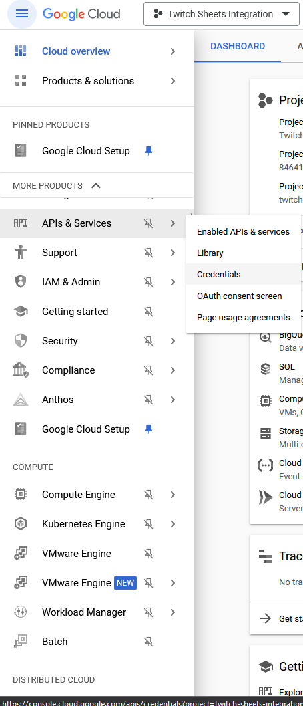

# SheetSync
Sync google spreadhseet fields to an HTML template

## What does this do?
This is primarily a javascript class to sync google spreadsheet information to specific elements within an HTML template.  The original implementation was created to easily manage Twitch.tv score overlays for fighting game tournaments for the [FightRise community](https://fightrise.com).

Using google spreadsheets and pulling the data into an HTML template allows for the following:

- Allows for HTML template overlays to be edited on the fly without having to mess directly with HTML (anyone who can understand Excel / Google Spreadsheets can run simple updates)
- Allows for permissions based way of allowing multiple users to be able to edit content for the overlay
- Allows for a free way to do the above without having to pay for hosting services or run a database backend

Eventually this was extended for usage in different formats for team tournaments as well as tennis bracket formats.  See below imagery:

Score Overlay: 

Team Format:

Tennis Format Overlay: 

This is primarily meant as a helpful tool/library for those familiar with at least some HTML/CSS/JS.  It is **NOT** meant to be a self contained working package for anyone to just be able to pick up and use without at least following some directions and tinkering.

## How can I use this?

### Prerequisites

Before you start note that you **MUST** have a [google cloud account](https://cloud.google.com).  Some helpful guides can be found below:

- [Instructions on starting to develop a Google Cloud project](https://developers.google.com/workspace/guides/create-project)
- [Instructions for enabling the sheets API](https://developers.google.com/workspace/guides/enable-apis)

Once you have enabled the above, you can create your google sheets API key by going to the google cloud dashboard and selecting from the menu APIs & Services -> Credentials 

You will then need to create a google spreadsheet with the data you want to feed into your HTML template

A sample version that works with the [demo template is available](https://docs.google.com/spreadsheets/d/1fFmMjV9JdtRFQOHF4AfXywUhlxBqvDctVMQ1SjqrG88/edit?usp=sharing).  You can just copy the format/data of the sheet into your own sheet.  
When setting permissions for the document, only grant edit access to people that you would like to update the data, but **you must provide Viewer access to anyone with the link.  This public access is needed so the HTML template can read the data.**

After you create your google spreadsheet the spreadsheet ID can be retrieved from the URL for example in the shared sheet above, the URL is https://docs.google.com/spreadsheets/d/1fFmMjV9JdtRFQOHF4AfXywUhlxBqvDctVMQ1SjqrG88/edit?usp=sharing , the spreadsheet ID is the string that comes after/d/ in the URL (1fFmMjV9JdtRFQOHF4AfXywUhlxBqvDctVMQ1SjqrG88)

### Working with the demo template

Once you have setup everything above open up the demo/scoreboard_localhost.html file in a text editor, you'll need to enter the spreadsheet ID and API key on lines 262/263 of the file.  If you have duplicated the demo spreadsheet, you should see something like the below screenshot 

Once your template is setup, and when you're streaming all you really should be doing is tweaking values in Column B and after you click off the cell (which saves the data), your web page should be updated with the data after approximately 1 second.  The update interval can be updated more quickly (or slowly), based on some settings values, but it is kept to this to be reasonably snappy and also not hit any google spreadsheet API rate limits.

## Format of the Google Spreadhseet 
The spreadsheet is setup where the first row is just setup as a header for labeling columns and the columns are setup in the following manner:
- HTML element ID (don't mess with unless you know what you're doing)
- Value used to pass to the template for the corresponding HTML element
- How to process the value on the HTML element (by default if this column is empty, the inner text property of the html element will just be updated, however more options are available, see the For developers section).  If non-default behavior is needed, a JSON string should be provided that has **action** and **value** (not all actions require a value) properties.  The following actions are supported
    - (blank/empty) - the text in column B will be updated in the corresponding HTML element 
    - background-image - (no value property required) the path in column B will be used to set as the background image for the HTML element specified
    - className - (no value property required) the class property for the HTML element specified will be set to the values provided.  Note that this will overwrite any other classes that may already exist in the HTML it completely replaces the class attribute.
    - classMap - (value property should be a JSON object with **options** and **values** properties, see cell C15 in the sample spreadsheet ).  This is primarily used for ease of use for authors by providing a dropdown select list of options in the spreadsheet with more helpful display names, that are different from the actual values used in the HTML template
    - attribute - (value property should be a string of the name of the attribute to set the value for on the corresponding HTML element).  This would be most useful for setting something like the src attribute on an image, or data- attribute for more complicated functionality.
    - style (value property should be a string of the style property to set).  This can be used to update CSS style properties for the corresponding HTML element, for example to set the background, width, font color, etc.  It's probably more efficient to just define a proper css class to be applied, but this is provided as a helper function for any strange corner cases where that may not be applicable.
    - callback (value property should be the name of the registerd callback function to call).  This will call a custom user function that has been registered.  This should be used for any complicated functionality that cannot be achieved by the actions above.
- Anything after is just for ease of use for authors/editors of the data

## For developers

The JS is pretty simple, just create an object with the api key, and spreadsheet id and pass this to the constructor of the SheetSync class.  All this really does is provide a way to pull spreadsheet data associated to HTML element ids and poll for updates.    

The options object for the constructor supports the following properties

- apiKey (required) the api key string from google cloud for the project support the google spreadsheet integration
- spreadsheetId (required) the id of the spreadsheet to pull data from
- syncTiming (optional) an integer in milliseconds for how often the web page should poll for updates/changes to data (default is 1000, to keep from hitting API rate limits)
- callbacks (optional) JSON object with properties for callbacks for devs to provide special processing to specific data

After the class is instantiated, simply call the sync function to start the data pulls.  

Some additional functions are provided:

- stopSync - stops the automatic polling of data
- registerCallback - allows registering custom callback functions for custom processing of data from the spreadsheet.  This allows for registering callbacks after the class has already been instantiated

The custom callbacks provided will be passed the following paramaters
- element (a reference to the DOM element specified for the data being passed)
- syncValue (string the value from the google spreadsheet from column B)
- processCommand (JSON object of whatever was passed in column C of the spreadsheet)

 
## FAQ (or what I anticipate people will ask)

### The HTML demo files don't seem to work!
That's not a question.  Also, make sure you read the sections above about prerequisites.  You need to make sure you have your google stuff setup on your end (with the proper access), and then provide the API key and spreadsheet ID to the script.  Look in the HTML source and see the sections marked **REQUIRED USER INPUT**.  If it's still not working, make sure to check the web developer console in your browser for any errors.

### How can I customize the HTML template?
If you're not familiar with HTML / CSS, then getting an advanced layout probably won't be possible.  The demo, does however allow you to tweak some of the colors/font sizes, etc. if you want to tinker.  You can mess with the css variables (lines 9 through 23 as of the current version) to tweak the values to pretty safely to just mess with things without having to touch the other css/html and still have everything functional.  

If you want to do something more custom then see the section above for developers.

### Are there any demos for the team tournament, tennis scoring functionality? 
Not yet, I'll need to adapt those from some of my older code, if/when I do that I'll update the demos.  

### Why is there a src/SheetSync.js if it's not being used?
The JS in that file is intended to be a JS module that can be included on hosted websites, however, for the demo templates and anyone that is streaming and just wants to run the html file local to their streaming computer (without running a web server), if you include a separate JS script you'll get CORS errors, that's why the same JS is included inline in the JS for the demo pages.  

### Are there any future plans for <X> feature?
Other than cleanup of some stuff and maybe more demo stuff, there are no current plans to add more features, until we actually think of something new to do.

### I need help, this is too complicated...
That's not a question, either.  The code above is provided as-is and while I am providing it to try and be helpful to others, I don't have time to troubleshoot issues, do custom design/dev, etc.    

